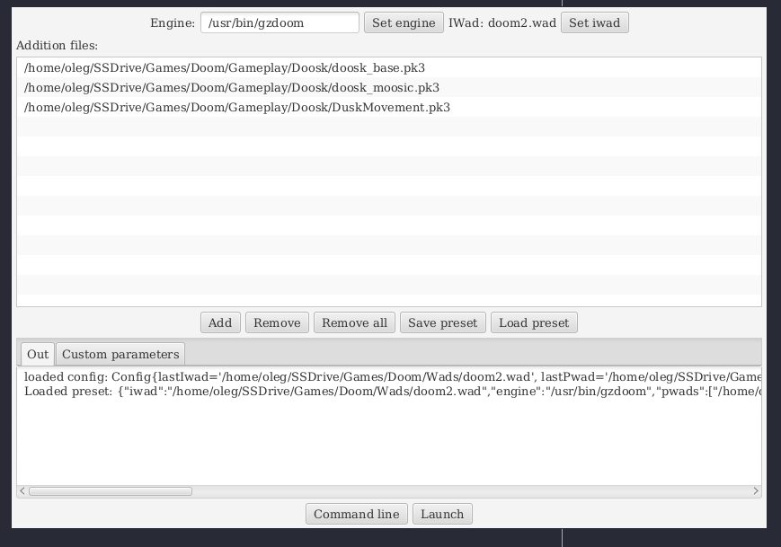

# DoomLauncherFX Program to launch doom with mods
https://github.com/zereb/DoomLauncherFX/releases/

Hello guys, here a program i created a while ago for my self to launch doom mods. It also can store mods presets so you can quickly load you favorite doom mod combinations.
I it's cross-platform, so it runs on linux and window (i use linux so this was one of the reasons why i wrote this). Maybe some of you will find this useful. Feedback appreciated.

